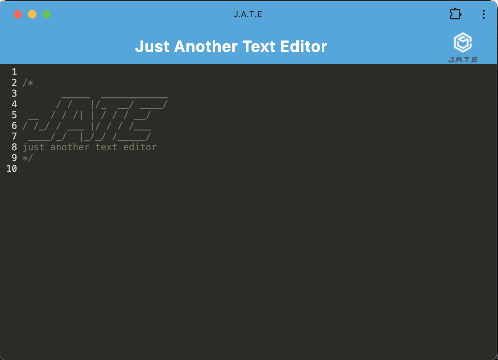

# J.A.R.T TextEditor

## Description
This is a PWA project creating a basic text editor for offline use.

## Dependencies
Run npm i to install dependencies. 

Uses webpack

## Authors
@GoldenRoad14 for Vanderbilt Full Stack Coding

## License
MIT